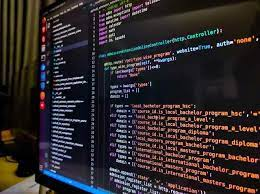

#estructura de datos 

> En este repositorio se encuentrarn temas a las principales estructuras de datos realizadas en `java `:

1 Recursividad
2.Arreglos
    -ventores
    -Matrices 
    -Metodos de busqueda
    -metodo de ordenamiento
3.Listas enlasadas 
    -Simples
    -Dobles
    -Circulares
Pilas y Colas
Arboles Binarios

